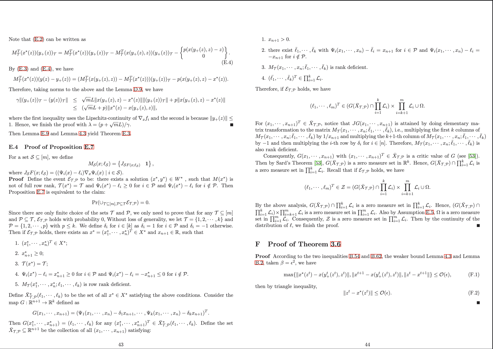

# 2-page-in-1-sheet-printing


# PDF Page Saver

This Python script transforms any PDF into a compact, paper-saving format by cropping unnecessary margins and arranging two pages side-by-side on a single landscape A4 sheet. It's perfect for printing academic papers where you want to maximize readability while minimizing paper usage. The script provides controls to asymmetrically crop "gutter" margins.

## Example Output

Here is a before-and-after comparison showing how a standard academic paper is transformed into a compact, print-ready format.




### Example Command

```bash
python pdf_merger.py input.pdf output.pdf --crop_top 8 --crop_bottom 8 --crop_left 8 --crop_right 8 --x_offset -43 --y_offset -80

```


### Command Explained

Crop each edge with different percentage. The combined 2-page pdf is located according to the adjusted center (x,y).
